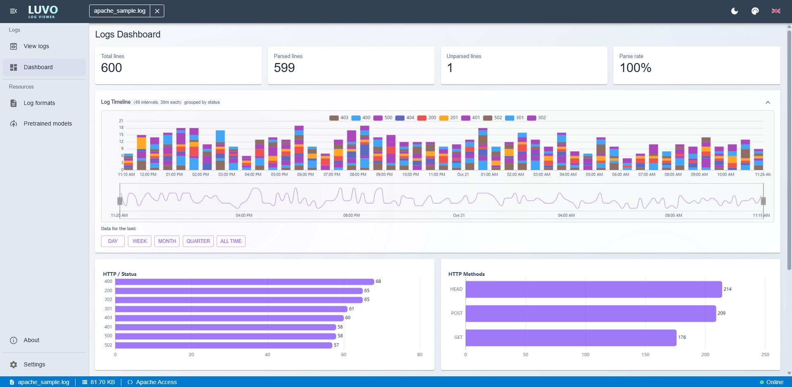
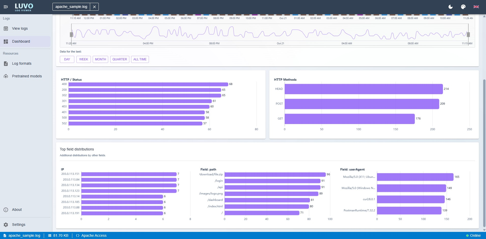
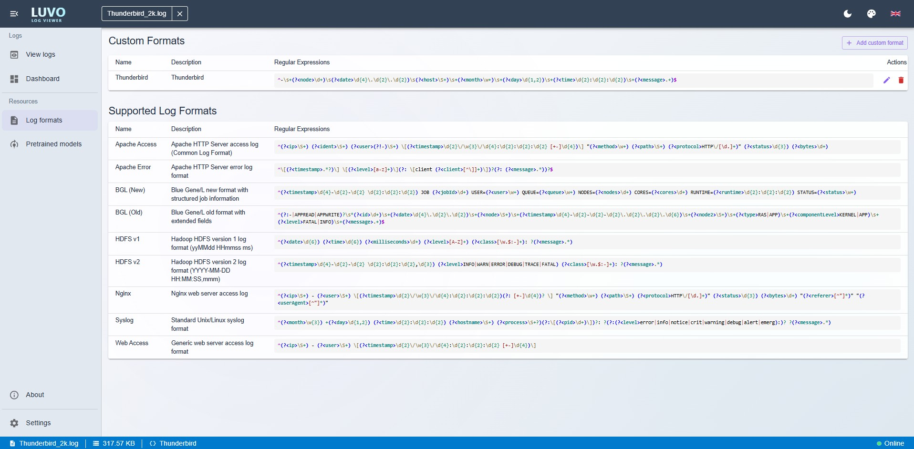
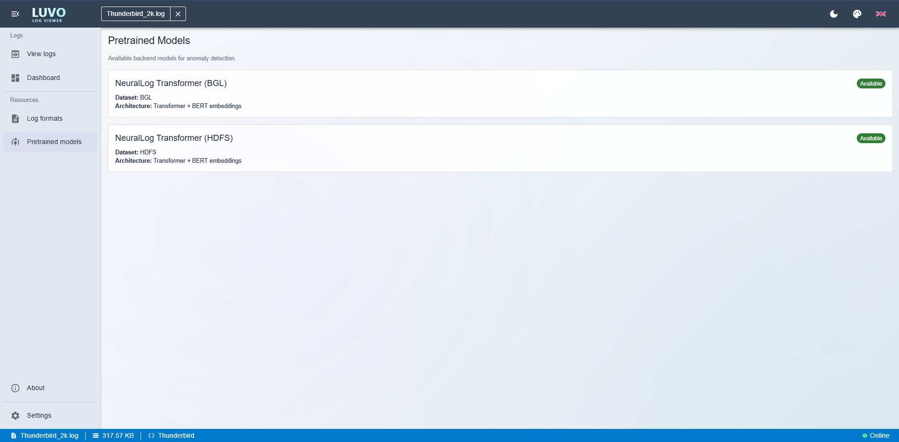
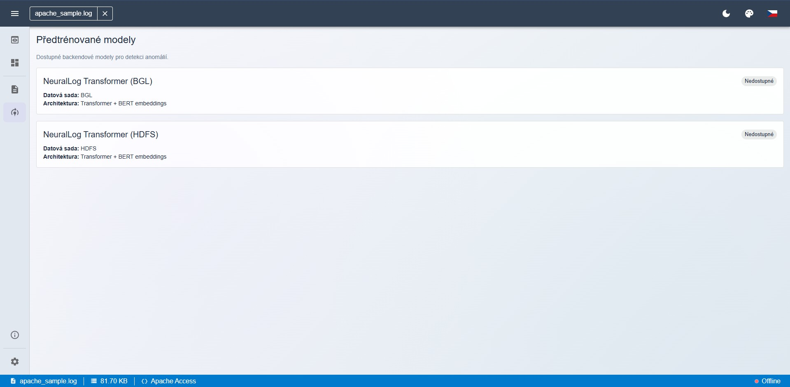
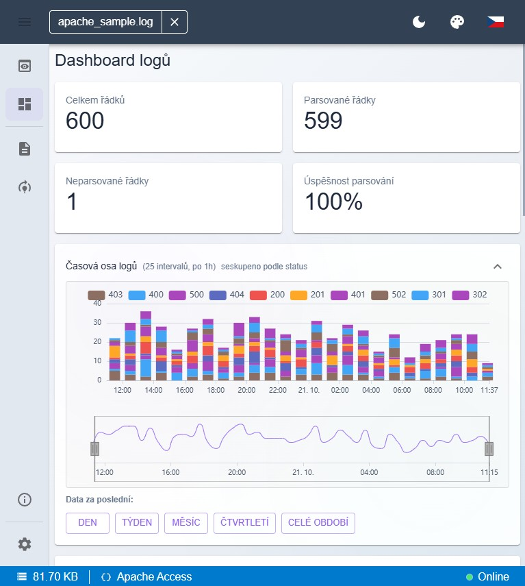

# Uživatelská příručka

Tato příručka popisuje práci s aplikací LuVo - Log Viewer.

Je určená pro běžného uživatele.

## 1. Orientace v aplikaci

Po spuštění aplikace se otevře výchozí stránka pro práci s logy. Levý postranní panel obsahuje hlavní sekce:

- View Logs: načtení souboru, prohlížení logových řádků, filtrování a detekce anomálií.
- Dashboard: souhrnné statistiky a grafy nad aktuálně načteným logem.
- Log Formats: správa podporovaných a vlastních formátů logů.
- Pretrained Models: přehled dostupných předtrénovaných modelů pro detekci anomálií.
- About: stručné informace o projektu.
- Settings: nastavení vzhledu, jazyka a prahu pro velké soubory.

## 2. View Logs

Sekce View Logs je hlavní pracovní plocha aplikace. Odtud začíná většina běžných scénářů.

### 2.1 Načtení souboru

1. Otevřete sekci View Logs.
2. Vyberte logový soubor pomocí dialogu pro výběr souboru nebo jej přetáhněte do okna aplikace.
3. Aplikace se pokusí automaticky rozpoznat formát logu.
4. Nejprve proběhne indexace a příprava dat pro rychlé zobrazení.

U velkých souborů je před odesláním na server k dispozici pouze základní prohlížení řádků. Filtrování, histogram a dashboard budou dostupné až po nahrání souboru na server a dokončení zpracování.

### 2.2 Automatické rozpoznání formátu

Po načtení souboru aplikace analyzuje strukturu řádků a pokusí se určit vhodný formát. Pokud je rozpoznán uživatelsky definovaný formát, je použit automaticky.

Jestliže aplikace formát nerozpozná, nabídne potvrzení nebo vytvoření vlastního formátu. V takovém případě pokračujte podle kapitoly [4. Log Formats](#4-log-formats), kde je popsáno vytvoření vlastního formátu.

Rozpoznaný formát lze v případě potřeby změnit i ručně. Kliknutím na název aktuálního formátu ve spodní stavové liště se otevře nabídka `Select log format` se seznamem dostupných formátů, ze kterých můžete vybrat jiný.

### 2.3 Prohlížení logových řádků

Po úspěšném načtení běžného souboru se zobrazí:

- histogram v horní části, který poskytuje základní přehled o rozložení zpracovaných logů, a graf pod ním, který zobrazuje časový průběh, označené anomální oblasti a umožňuje vybrat časový rozsah,
- hlavní panel nástrojů pro přepínání způsobu zobrazení, volbu pořadí řádků `Od začátku` nebo `Od konce`, textové vyhledávání, pohyb mezi nalezenými shodami, otevření filtrů a ovládání detekce anomálií včetně nastavení,
- seznam nebo tabulka logových řádků ve spodní části, kde lze procházet načtený obsah souboru a pracovat s aktuálně zobrazeným nebo vyfiltrovaným výřezem dat.

U běžných lokálně otevřených souborů obsahuje hlavní panel také sekci `Obnovení`, ve které lze data načíst znovu ručně tlačítkem `Obnovit` nebo zapnout průběžné obnovování pomocí tlačítka `Auto`. To je užitečné zejména při sledování souboru, který se průběžně doplňuje.

Ve spodní stavové liště se zobrazují základní informace o aktuální práci se souborem. Typicky zde uvidíte název souboru, jeho velikost, rozpoznaný formát logu, průběh indexace nebo nahrávání na server, stav detekce anomálií včetně použitých parametrů po dokončení analýzy a také indikátor, zda je backend online nebo offline.

U velkých souborů nahraných na server jsou k dispozici stejné funkce s výjimkou aktualizace v reálném čase; pro aktualizaci souboru na serveru je nutné nahrát aktualizovaný soubor znovu.

### 2.4 Vyhledávání v logu

Vyhledávání slouží pro rychlé nalezení konkrétního textu, chybového kódu, názvu komponenty nebo jiné části řádku.

1. Pole pro hledání otevřete kliknutím do vyhledávání nebo klávesovou zkratkou Ctrl+F a zadejte hledaný text.
2. Výsledky se promítnou do zobrazených řádků.
3. Vyhledávání lze kombinovat s časovým nebo kategoriálním filtrem.

### 2.5 Filtrování pomocí histogramu

Histogram poskytuje přehled o rozložení dat a výběr časového úseku probíhá na grafu pod ním. To je praktické zejména při práci s dlouhými logy.

Tato funkce je dostupná až ve chvíli, kdy má aplikace k dispozici zpracovaná data. U běžných souborů po dokončení indexace, u velkých souborů až po nahrání souboru na server a dokončení zpracování.

1. Vyberte oblast v grafu pod histogramem.
2. Aplikace omezí seznam řádků na zvolený interval.
3. Podle potřeby filtr zrušte nebo změňte.

### 2.6 Detekce anomálií

Detekci anomálií lze spustit nad načteným logem. Výsledek závisí na dostupnosti backendu a zvoleném modelu.

Typický postup:

1. Načtěte soubor v sekci View Logs.
2. Otevřete nastavení detekce, pokud chcete upravit parametry.
3. Spusťte detekci anomálií.
4. Sledujte průběh a po dokončení procházejte nalezené anomální oblasti.

Základní dialog nastavení detekce anomálií:

V tomto dialogu lze stručně upravit:

- práh: určuje, jak přísně se mají anomálie vyhodnocovat; nižší hodnota obvykle najde více anomálií,
- velikost kroku: určuje, jak jemně se data kontrolují; menší krok je detailnější, ale pomalejší,
- min. oblast: nastavuje minimální délku souvislé anomální oblasti, aby se omezil šum,
- profily Citlivý, Vyvážený a Přísný: rychle nastaví doporučenou kombinaci parametrů podle požadované citlivosti.

Pokud se v dialogu zobrazí upozornění, znamená to, že zvolená kombinace parametrů může výrazně prodloužit výpočet. V kritickém případě aplikace před spuštěním analýzy vyžádá potvrzení.

Dialog s upozorněním na vysokou výpočetní zátěž:

Pokud detekce běží na serveru asynchronně, aplikace průběžně zobrazuje stav zpracování.

Po dokončení se anomálie zobrazí přímo v přehledu a lze na ně navázat dalším filtrováním, přechodem přes graf na příslušný časový rozsah (1), pohybem mezi jednotlivými anomáliemi pomocí šipek v panelu nástrojů (2) nebo kontrolou konkrétních řádků. Ve spodní informační liště lze zároveň zkontrolovat, s jakými parametry byla analýza spuštěna: model, použitý práh, krok a minimální oblast, a také jaké procento řádků bylo označeno jako anomální (3).

Je vhodné počítat s tím, že výpočet anomálií může trvat delší dobu. U velkých souborů to může být přibližně od půl hodiny až po několik hodin podle počtu řádků a rozsahu zpracovávaných dat. Opakované spuštění analýzy pro stejný soubor a stejný model, ale s jinými parametry, bývá rychlejší, protože již není nutné znovu počítat embeddingy.

### 2.7 Offline režim a nedostupný server

Pokud backend není dostupný, vzdálené operace nemusí být možné. Typicky se to týká odesílání velkých souborů nebo serverové detekce anomálií.

Pokud potřebujete pracovat bez backendu, používejte lokální funkce aplikace a menší soubory, které není nutné odesílat na server.

## 3. Dashboard

Sekce Dashboard poskytuje souhrnný analytický pohled na aktuálně načtený soubor. Slouží zejména pro rychlou orientaci v datech před detailním čtením jednotlivých řádků.

U velkých souborů je dashboard dostupný až po nahrání souboru na server a po dokončení zpracování.

Na dashboardu lze typicky sledovat:

- horní souhrnné karty s počtem řádků, počtem rozpoznaných a nerozpoznaných záznamů a procentem úspěšně rozpoznaných řádků,
- histogram, který poskytuje přehled o rozložení logů v čase, a spodní graf pod ním, na kterém lze vybrat sledované období,
- horní řadu sloupcových grafů pro hlavní kategorie, například úroveň logu, HTTP status, HTTP metodu nebo úroveň komponenty,
- spodní doplňkové grafy pro další rozpoznané pole a kategorie nalezené v načtených datech.

Pomocí filtrů na dashboardu lze zúžit analyzovaný výřez. Časové filtry přepočítají a aktualizují horní souhrnné karty i všechny zobrazené grafy. Ve spodní části lze navíc použít rychlé časové předvolby, například pro poslední den, týden nebo měsíc.

Analogickým způsobem fungují i filtry podle legendy histogramu, které rovněž aktualizují zobrazené panely a grafy.

## 4. Log Formats

Sekce Log Formats slouží ke správě formátů, podle kterých aplikace rozpoznává a parsuje logové řádky.

Zde najdete dvě skupiny formátů:

- systémové formáty dodané aplikací,
- vlastní uživatelské formáty.

V této sekci můžete:

- přidat nový vlastní formát,
- upravit existující vlastní formát,
- odstranit vlastní formát,
- zkontrolovat regulární výraz použitý pro parsování.

Doporučený postup při vytváření vlastního formátu:

1. Pokud aplikace při načtení souboru oznámí, že formát nebyl rozpoznán, potvrďte vytvoření vlastního formátu tlačítkem `OK`.

2. Otevře se dialog `Add Custom Log Format`, ve kterém aplikace předvyplní název podle souboru. Název můžete upravit na kratší a přehlednější označení formátu. Poté doplňte pole `Description`, aby bylo zřejmé, pro jaký typ logů je formát určen.

3. Do pole `Regular Expression` zadejte regulární výraz s pojmenovanými skupinami. Pro správné zvýraznění a filtrování je vhodné zachytit alespoň zprávu a časové údaje; pokud si nejste jistí syntaxí, použijte tlačítko `HINT`.

4. Sledujte oblast `Preview parsing of first 5 lines`, kde aplikace okamžitě ukazuje, jak budou první řádky rozparsovány. Pokud se zobrazí chyba, například duplicitní názvy skupin, upravte názvy ručně nebo použijte nabídnutou opravu `AUTO-FIX DUPLICATE NAMES`.

5. Pokračujte v úpravě regulárního výrazu, dokud náhled nezačne odpovídat očekávané struktuře. Jakmile se v náhledu zobrazí doporučená pole, například `date`, `time`, `message` nebo `host`, je výraz obvykle nastaven správně.
6. Po ověření náhledu klikněte na `SAVE AND APPLY`. Nový formát se uloží a rovnou použije na aktuálně otevřený soubor.

Pokud vytváříte formát přímo z dialogu po načtení neznámého souboru, je to obvykle nejrychlejší cesta, protože náhled vychází z konkrétních ukázkových řádků aktuálního logu.

## 5. Pretrained Models

Sekce Pretrained Models zobrazuje seznam dostupných předtrénovaných modelů pro detekci anomálií. U každého modelu je uveden alespoň název, dataset, architektura a informace o dostupnosti.

Tuto stránku použijte zejména tehdy, když chcete:

- ověřit, které modely jsou v prostředí dostupné,
- zjistit, pro jaký dataset je model určen,
- zkontrolovat, zda je model připraven k použití.

## 6. Settings

V sekci Settings lze upravit uživatelské prostředí a některé provozní parametry aplikace.

K dispozici je zejména:

- přepnutí světlého a tmavého motivu,
- nastavení prahu, od kterého se soubor považuje za velký,
- výběr hlavní barvy rozhraní,
- změna jazyka aplikace.

Následující ukázka zobrazuje práci s aplikací po přepnutí do tmavé varianty.

### 6.1 Doporučení pro práh velkého souboru

Pokud často pracujete s rozsáhlými logy, upravte práh podle výkonu svého zařízení:

- nižší hodnota: aplikace dříve rozpozná soubor jako velký a omezí se na režim vhodný pro velké soubory,
- vyšší hodnota: více souborů bude otevřeno standardním způsobem.

Pokud nastavíte příliš vysoký práh pro velký soubor, může být práce v offline režimu u objemných logů pomalejší, protože aplikace bude zkoušet více dat zpracovat lokálně. Skutečný dopad ale závisí na parametrech zařízení uživatele, zejména na dostupné paměti, výkonu procesoru a rychlosti úložiště.

Pokud si nejste jisti, ponechte doporučenou výchozí hodnotu.

## 7. Použití na tabletu a menších obrazovkách

Aplikace je použitelná i na menších displejích, ale některé části rozhraní jsou kompaktnější. Postranní panel bývá sbalený a některé popisky mohou být zkrácené.

## 8. Doporučený pracovní postup

Pro běžnou práci je vhodné postupovat v tomto pořadí:

1. Otevřete View Logs a načtěte soubor.
2. Zkontrolujte, zda aplikace správně rozpoznala formát.
3. U běžných souborů použijte vyhledávání a histogram pro zúžení relevantní části logu.
4. U běžných souborů otevřete Dashboard a získejte rychlý přehled o datech.
5. Pokud pracujete s velkým souborem, nejprve jej nahrajte na server a vyčkejte na dokončení zpracování.
6. Pokud je potřeba, spusťte detekci anomálií.
7. Pokud formát není rozpoznán správně, vytvořte nebo upravte pravidlo v Log Formats.
8. V Settings upravte jazyk, vzhled nebo práh pro velké soubory podle svého prostředí.

## 9. Nejčastější situace

### Soubor se nenačetl správně

- Ověřte, že jde o podporovaný soubor s příponou `.txt`, `.log` nebo `.json`.
- Pokud formát není rozpoznán, vytvořte vlastní formát v Log Formats.
- U velkého souboru počítejte s tím, že před nahráním na server bude dostupné pouze základní prohlížení řádků.

### Nejde spustit serverová detekce anomálií

- Zkontrolujte, zda je backend dostupný  nebo .
- Ověřte dostupnost modelu v sekci Pretrained Models.
- Pokud pracujete offline, u velkých souborů bude k dispozici pouze základní prohlížení řádků.

## 10. About

Stránka About obsahuje stručný popis projektu, hlavní schopnosti aplikace a informace o akademickém kontextu projektu.

